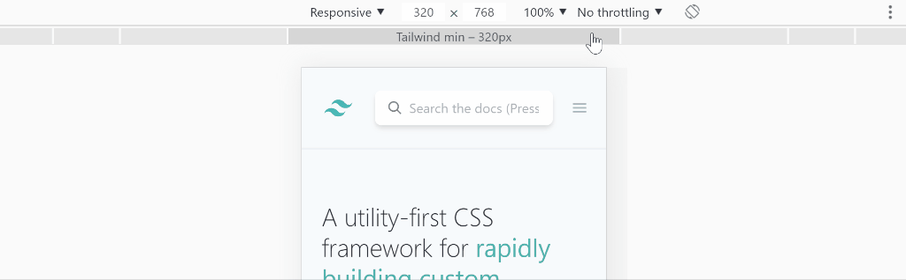

# Custom Chrome Device Presets

Override the default Chrome DevTools device presets with breakpoints for popular CSS frameworks.



## Background

The device size presets built into the Chrome DevTools are fixed, with no customisation options or extension API.

This script allows you to patch the Chrome resources file, where these presets are defined, allowing you to use a range of other sizes.

## Disclaimer

This is an experimental script, it modifies the resources file used by Chrome which contains various scripts and localisation assets. By using this script you agree to do so at your own risk.

## Prerequisites

 - Python 2.7


## Running the script

1. Close all running Chrome instances.
1. Create a new working directory somewhere convenient.
1. Locate the Chrome installation directory on your machine.
For example:
    ```
    C:\Program Files (x86)\Google\Chrome\Application\
    ```
    or
    ```
    /opt/google/chrome/
    ```
1. Locate the file `resources.pak`. _This may be in a version specific subdirectory. For example, `75.0.3770.100`_
1. Copy the `resources.pak` datapack file to your working directory and rename it, e.g. `resources.pak.bak`.
_Important: Keep this file safe in case you want to revert to the original configuration._
1. Run the script passing in the name of the original resources file from above and the breakpoint presets you want to use.
    ```
    ./custom-device-presets.py ./working-dir/resource.pak.bak tailwind
    ```
5. The script will create a new patched resources file in the current directory.
1. Copy this file to the Chrome installation directory, overwriting the original resources file. _You may require administrator/root privileges to perform this step._

### Presets

The breakpoint presets you can choose from are:
 - `default` - the original Chrome device presets.
 - `tailwind` - the breakpoints from Tailwind CSS (sm, md, lg, xl) plus xs (320px) and 4K (2560px) options.
 - `bootstrap4` - the breakpoints from Bootstrap 4 (xs, sm, md, lg, xl) plus a 4K (2560px) option.

## If something goes wrong

Should the resources file be patched incorrectly, Chrome may fail to load some extensions, syncing will be disabled, and loading a webpage may display unrendered source text.

If this happens:
1. Close Chrome.
1. Copy your resource backup file `resources.pak.bak` into the Chrome version directory and remove the `.bak` extension.
1. Open Chrome.
1. Click on your profile icon.
1. Turn on sync. _You do not need to reset your settings._
1. Enter your passphrase, if required.

## Notes

 - You will lose any preset customisations when Chrome automatically updates. If that happens you will have to run the script on the resources file for the new version.


## License

This script is licensed under the Unlicense - see the [LICENSE](LICENSE) file for details